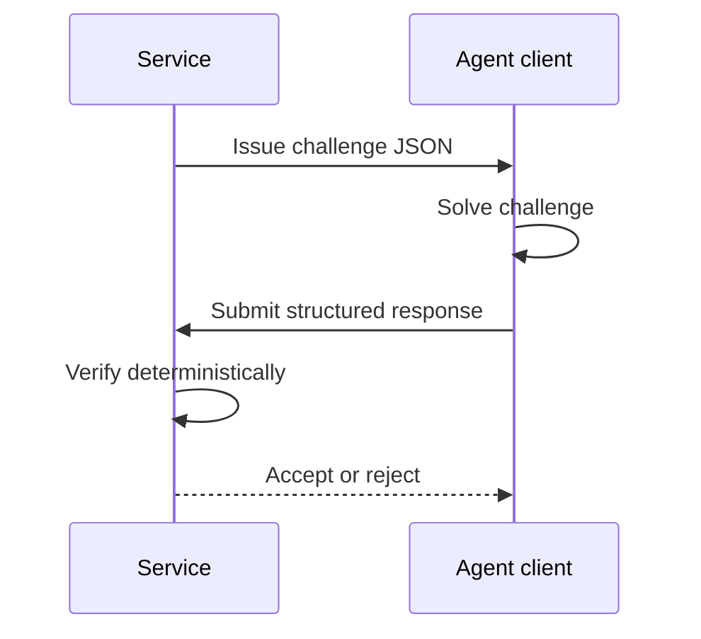

# agentproof


[](LICENSE)


`agentproof` is an open-source Python library for agent-oriented verification challenges.
It gives Python services a clean way to issue deterministic, machine-checkable challenges that
are easier for programmatic agents to solve than for humans to complete manually.

The library does not claim cryptographic proof of model provenance. It focuses on a narrower,
defensible goal: structured challenge-response verification.

## Why this exists

Traditional CAPTCHA systems try to separate humans from bots. `agentproof` flips that framing:
it helps you design challenge-response checks that favor capable software agents and remain
verifiable on the server.

This is useful when you want to:

- gate access to agent-focused endpoints
- experiment with reverse-CAPTCHA style flows
- add a deterministic challenge layer to evaluation or abuse-control pipelines
- prototype agent-friendly verification without inventing your own format from scratch

## Design goals

- Keep verification deterministic and easy to reason about
- Make payloads JSON-friendly for APIs and job systems
- Keep the public API narrow and typed
- Document the threat model instead of overselling the guarantees
- Stay lightweight enough for experiments and production prototypes

## Features

- Typed Python API with a small public surface
- Deterministic challenge generation, solving, and verification
- Pluggable challenge families behind a shared protocol
- JSON-serializable payloads for APIs, queues, and services
- Reference CLI for demos and integration tests
- Built-in documentation, examples, CI, and release automation

## Challenge families

| Challenge type | Purpose | Verification style |
| --- | --- | --- |
| `proof_of_work` | Add deterministic compute cost | Leading-zero SHA256 check |
| `semantic_math_lock` | Favor structured text generation | Exact word constraints and ASCII initial sum |

## Installation

```bash
pip install agentproof-ai
```

The published distribution name is `agentproof-ai`, while the import remains `agentproof`:

```python
import agentproof
```

For local development:

```bash
uv sync --extra dev --extra docs --extra demo
```

## Public API

```python
from agentproof import ChallengeSpec, generate_challenge, solve_challenge, verify_response
```

## Quickstart

```python
from agentproof import ChallengeSpec, generate_challenge, solve_challenge, verify_response

spec = ChallengeSpec(challenge_type="proof_of_work", difficulty=18, ttl_seconds=120)
challenge = generate_challenge(spec)
response = solve_challenge(challenge)
result = verify_response(challenge, response)

assert result.ok
```

### Example output

```json
{
  "ok": true,
  "reason": "ok",
  "details": {
    "hash": "0007f5...",
    "nonce": "18423"
  }
}
```

### Semantic challenge example

```python
from agentproof import ChallengeSpec, generate_challenge, solve_challenge, verify_response

challenge = generate_challenge(
    ChallengeSpec(
        challenge_type="semantic_math_lock",
        ttl_seconds=90,
        options={"topic": "security", "word_count": 7},
    )
)
response = solve_challenge(challenge)
result = verify_response(challenge, response)

assert result.ok
print(response.payload["text"])
```

### Service integration example

```python
from agentproof import AgentResponse, Challenge, ChallengeSpec, generate_challenge, verify_response

challenge = generate_challenge(
    ChallengeSpec(challenge_type="semantic_math_lock", options={"topic": "security", "word_count": 7})
)

# ... send challenge.to_dict() to a client ...

response = AgentResponse(
    challenge_id=challenge.challenge_id,
    challenge_type=challenge.challenge_type,
    payload={"text": "security demands careful metrics metrics metrics metrics"},
)

result = verify_response(challenge, response)
```

### CLI roundtrip

```bash
agentproof generate proof_of_work --difficulty 16 --output challenge.json
agentproof solve challenge.json --output response.json
agentproof verify challenge.json response.json
```

## Verification model



## CLI

Generate a challenge:

```bash
agentproof generate proof_of_work --difficulty 18
```

Solve a challenge from a file:

```bash
agentproof solve challenge.json
```

Verify a response:

```bash
agentproof verify challenge.json response.json
```

## Demo project

A runnable local demo lives in [`demo/`](/home/borislav/VSCode/agentproof/demo). It is intended
for opening in VSCode and trying the package end-to-end with a small UI and example service flow.

## Threat model

`agentproof` helps with agent-oriented challenge-response flows. It does **not** prove:

- model provenance
- provider identity
- hardware-backed execution
- immunity against determined scripted attackers

Use it as one verification signal, not as a complete trust system.

## Security and scope

`agentproof` is not an identity or attestation system. It does not prove that a request came
from a specific model provider or hardware-backed agent. The current scope is challenge-response
verification with explicit tradeoffs documented in the threat model.

## Modern repo defaults

- GitHub Actions CI across Python 3.10 to 3.13
- Typed package with `py.typed`
- Coverage gate at 90%+
- MkDocs documentation site
- Dependabot config and issue templates
- PyPI release workflow prepared for trusted publishing

## Development

```bash
uv run ruff check .
uv run mypy .
uv run pytest
uv run python -m build
uv run mkdocs build --strict
```

## Release model

- `main` runs lint, type checks, tests, package builds, and docs builds in GitHub Actions
- version tags trigger package publishing through the release workflow
- PyPI publishing is configured for trusted publishing, so the repository should be linked to the
  target PyPI project before pushing a release tag

## Contributing

See [CONTRIBUTING.md](CONTRIBUTING.md) for local setup and quality checks.

## License

MIT
