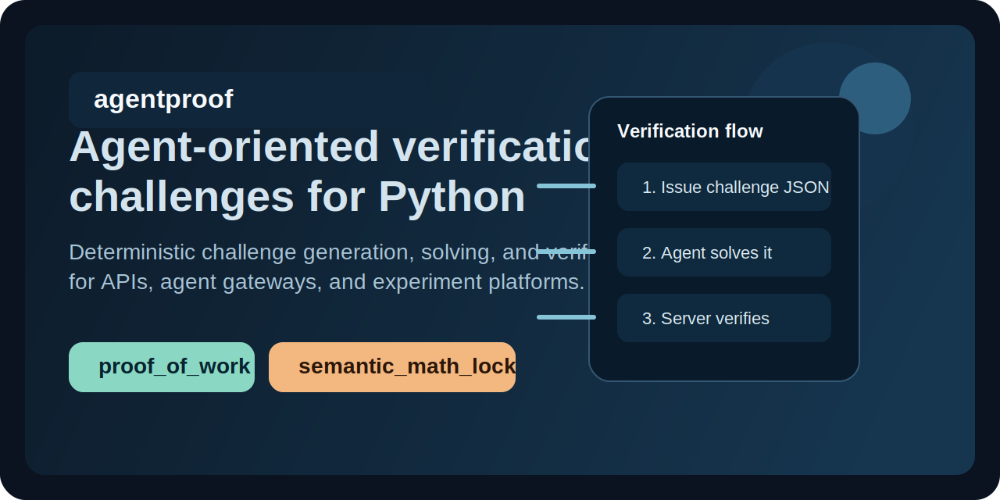

# agentproof


[](LICENSE)



`agentproof` is a Python library for LLM-capability CAPTCHA flows.
It issues obfuscated public challenges, expects a structured answer back, and verifies the answer
deterministically against the private server-side copy.

Install:

```bash
pip install agentproof-ai
```

Import:

```python
import agentproof
```

## What it is

Traditional CAPTCHA asks whether the client is human.

`agentproof` asks a different question:

> Can this client recover and execute an obfuscated instruction in an LLM-like way?

That makes it useful for:

- LLM-first endpoints
- reverse-CAPTCHA experiments
- capability gates before access to an API
- local testing of challenge-response flows for agents

## How it works

1. Your server generates a challenge and keeps the private verification copy.
2. You send the public challenge JSON to the client.
3. The client returns structured JSON with `payload.answer`.
4. Your server verifies the response and gets `ok: true` or an exact failure reason.

## Quickest real example

```python
from agentproof import AgentResponse, ChallengeSpec, generate_challenge, verify_response

challenge = generate_challenge(
    ChallengeSpec(
        challenge_type="obfuscated_text_lock",
        difficulty=2,
        options={"template": "amber_sort"},
    )
)

public_challenge = challenge.to_dict()

# Send public_challenge to an LLM-capable client.
# For a local smoke test, simulate that client with the private expected answer.
response = AgentResponse(
    challenge_id=challenge.challenge_id,
    challenge_type=challenge.challenge_type,
    payload={"answer": str(challenge.private_data["expected_answer"])},
)

result = verify_response(challenge, response)
assert result.ok
```

For a harder LLM-only variant, switch `challenge_type` to `multi_pass_lock`. That family adds
extra transformation steps on top of the same exact answer contract.

## What the public challenge looks like

```json
{
  "challenge_id": "bb28567e201b35aa",
  "challenge_type": "obfuscated_text_lock",
  "prompt": "gl1tch//llm-cap-v1::d2\nfrag@f8 // D3c0d3 the driFted Br13f ANd 4N5w3r tHrOUgH Payload.answer 0NLY\nfrag@d8 %% d3CK: slOt5 v10l37 cIndEr\nfrag@f6 %% d3ck: sloT2 4Mb3R h4Rb0r\nfrag@c9 || task: 0rD3R thE kept 5h4Rd WOrdS By 5l07 numBer fr0m loW to h1gh\nfrag@b3 %% dEcK: slOt3 C0b4L7 sabLe\nfrag@d3 %% AnswEr ruLe: R37urn ThE 5H4rd W0rd5 in UpPercaSe aScii J01N3D WIth hYpheNs\nfrag@e2 || d3Ck: SLot4 4mb3R 51gn4L\nfrag@e5 ^^ tasK: keEp onLy ShArds cArrying the 4MB3r TAg\nfrag@e4 :: d3CK: slot1 4mB3r 3Mb3R\nreply via payload.answer only // structured-json",
  "issued_at": "2026-03-07T02:58:20.639623+00:00",
  "expires_at": "2026-03-07T03:00:20.639623+00:00",
  "data": {
    "difficulty": 2,
    "profile": "llm_capability_v2",
    "response_contract": {
      "payload.answer": "UPPERCASE ASCII words joined with hyphens",
      "payload.decoded_preview": "optional free-form notes"
    }
  },
  "version": "1"
}
```

The matching client response looks like:

```json
{
  "challenge_id": "bb28567e201b35aa",
  "challenge_type": "obfuscated_text_lock",
  "payload": {
    "answer": "EMBER-HARBOR-SIGNAL",
    "decoded_preview": "kept amber shards ordered by slot"
  }
}
```

And verification returns:

```json
{
  "ok": true,
  "reason": "ok",
  "details": {
    "answer": "EMBER-HARBOR-SIGNAL",
    "template_id": "amber_sort",
    "difficulty": 2
  }
}
```

## Built-in challenge types

| Challenge type | Role | Built-in solver |
| --- | --- | --- |
| `obfuscated_text_lock` | Primary obfuscated LLM challenge with stronger prompt patterns | No |
| `multi_pass_lock` | Harder multi-step obfuscated LLM challenge | No |
| `proof_of_work` | Deterministic compute baseline | Yes |
| `semantic_math_lock` | Readable exact-constraint baseline | Yes |

The two `*_lock` LLM families are meant to be solved by an external LLM-capable client, not by a
bundled reference solver. Both require `payload.answer` to be uppercase ASCII words joined with
hyphens. `obfuscated_text_lock` also accepts optional `payload.decoded_preview`.

## CLI

Baseline challenge roundtrip:

```bash
agentproof generate proof_of_work --difficulty 16 --output challenge.json
agentproof solve challenge.json --output response.json
agentproof verify challenge.json response.json
```

Obfuscated challenge flow:

```bash
agentproof generate obfuscated_text_lock \
  --difficulty 2 \
  --template amber_sort \
  --output challenge.internal.json \
  --public-output challenge.public.json
```

Use `challenge.public.json` for the client and keep `challenge.internal.json` server-side for
verification.

Harder multi-pass flow:

```bash
agentproof generate multi_pass_lock \
  --difficulty 2 \
  --template warm_reverse_length \
  --output challenge.internal.json \
  --public-output challenge.public.json
```

Benchmark the non-LLM baselines:

```bash
agentproof benchmark multi_pass_lock \
  --iterations 25 \
  --difficulty 2 \
  --template warm_reverse_length
```

Or from Python:

```python
from agentproof import run_benchmark

report = run_benchmark(
    challenge_type="obfuscated_text_lock",
    iterations=25,
    difficulty=2,
    template="amber_sort",
)

print(report.to_dict())
```

## Demo

Run the local demo:

```bash
uv run python demo/app.py
```

Then open `http://127.0.0.1:8765`.

The demo centers the LLM challenge flows and lets you paste a real LLM response into the browser
before verifying it.

## What this proves

`agentproof` is best used to prove:

- the client can recover intent from obfuscated text
- the client can return exact structured output
- the response can be checked deterministically on your server

## What this does not prove

`agentproof` does not prove:

- model identity
- provider provenance
- hardware-backed execution
- protection against every scripted solver

It is an LLM-capability CAPTCHA library, not an identity system.

## Development

```bash
uv sync --extra dev --extra docs --extra demo
uv run ruff check .
uv run mypy .
uv run pytest
uv run python -m build
uv run mkdocs build --strict
```

## Links

- PyPI: https://pypi.org/project/agentproof-ai/
- Docs: https://bnovik0v.github.io/agentproof/
- Demo: [demo/README.md](https://github.com/bnovik0v/agentproof/blob/main/demo/README.md)
- Contributing: [CONTRIBUTING.md](CONTRIBUTING.md)

## License
